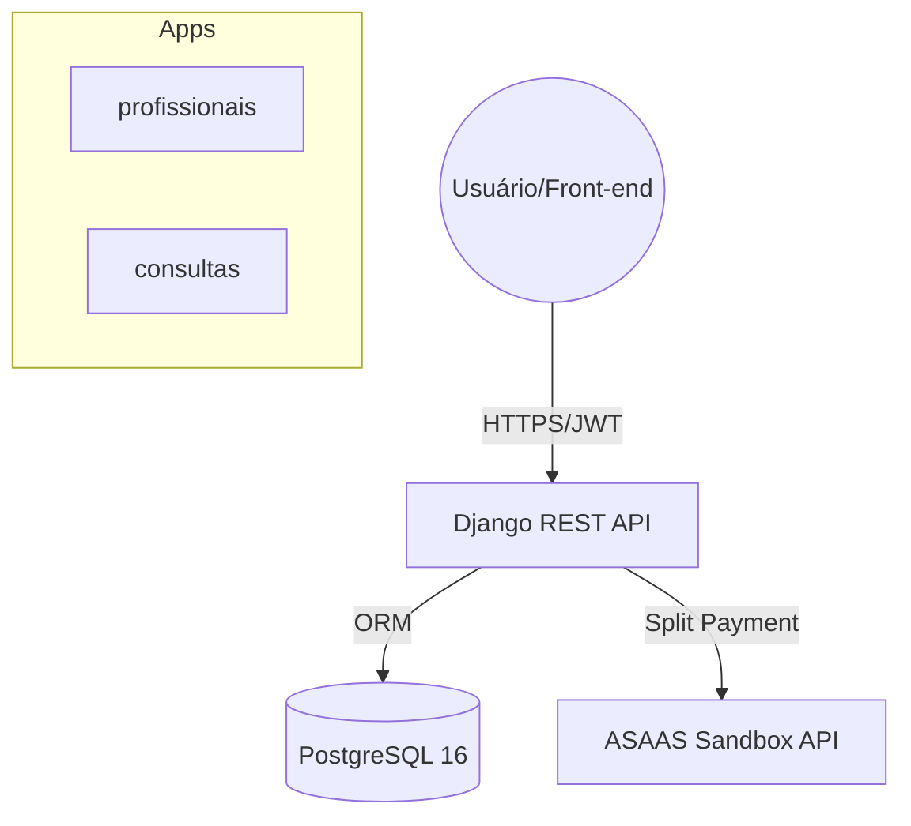

# Lacrei Saúde API v2 - Gerenciamento de Consultas Médicas 🌈

Esta é a versão 2 da API RESTful para o desafio técnico da Lacrei Saúde, agora utilizando uma estrutura padrão do Django (apps na raiz) para melhor legibilidade e conformidade com as melhores práticas do framework.

---

## 🏗️ Arquitetura do Sistema

O projeto utiliza uma estrutura **Descentralizada (Padrão Django)** onde cada domínio de negócio (Profissionais e Consultas) possui seu próprio aplicativo Django.



---

## 🛠️ Tecnologias Utilizadas

- **Python 3.12 + Django 6.0**: Framework principal.
- **Django REST Framework**: Para construção da API.
- **Poetry**: Gerenciamento de dependências.
- **PostgreSQL**: Banco de dados relacional.
- **Docker & Docker Compose**: Containerização.
- **GitHub Actions**: Pipeline de CI/CD.
- **SimpleJWT**: Autenticação via tokens JWT.
- **drf-spectacular**: Documentação OpenAPI 3.0 (Swagger/Redoc).

---

## 🚀 Como Executar o Projeto

### 1. Via Docker (Recomendado)
```bash
docker-compose up -d
docker-compose exec web python manage.py migrate
```
Acesse a API em: `http://localhost:8000/api/`

### 2. Ambiente de Desenvolvimento (Nix + Poetry)
Se você utiliza o **Nix**, o projeto já possui um `flake.nix` para configurar todo o ambiente (Python, Poetry, Postgres) automaticamente:
```bash
# Entrar no ambiente
nix develop

# Instalar dependências (na primeira vez)
poetry install

# Rodar migrações e servidor
poetry run python manage.py migrate
poetry run python manage.py runserver
```

### 3. Local (Apenas Poetry)
```bash
# Instalar dependências
poetry install
# ... (restante dos comandos)
```

---

## 🧪 Testes e Qualidade

Foram implementados testes automatizados cobrindo CRUD, validações de data, unicidade e integração com pagamentos.

**Executar Testes:**
```bash
poetry run python manage.py test
```

---

## 🔒 Segurança e Regras de Negócio

- **Autenticação**: Todas as rotas (exceto token) exigem JWT.
- **Validação**: Impedimento de consultas em datas passadas e horários duplicados.
- **Integridade**: `UniqueConstraint` no banco de dados para evitar duplicidade de profissionais e horários.
- **CORS**: Configurado via `django-cors-headers`.
- **Sanitização**: Realizada via Serializers do DRF.

---

## 💸 Integração ASAAS (Split de Pagamento)

O sistema implementa uma proposta de **Split de Pagamento** funcional:
1. Ao criar uma consulta, o sistema verifica se o profissional tem um `asaas_wallet_id`.
2. Uma cobrança PIX é gerada automaticamente no ASAAS.
3. O valor é dividido (80% para o profissional, 20% para a plataforma).

---

## 🔄 Pipeline CI/CD e Deploy (AWS)

### Fluxo de Deploy
Utilizamos GitHub Actions para automatizar o ciclo de vida:
1. **Lint**: Verificação de estilo com Flake8.
2. **Testes**: Execução da suíte completa com banco de dados real (Postgres Docker).
3. **Build**: Criação da imagem Docker.
4. **Deploy**: Envio para instâncias AWS (ECS/EC2) via estratégia **Blue/Green**.

### 🔄 Estratégia de Rollback
Em caso de falha após o deploy (detectada via Health Checks ou métricas do CloudWatch):
- O AWS Load Balancer reverte automaticamente o tráfego para a versão anterior (**Blue**).
- O pipeline pode ser revertido manualmente no GitHub Actions usando o comando `Revert` no commit ou redeploy de tags anteriores.

---

## 📝 Decisões Técnicas
- **Apps na Raiz**: Optamos pela estrutura padrão do Django para facilitar a descoberta de módulos e seguir a convenção da comunidade.
- **Gunicorn**: Utilizado como servidor WSGI para produção dentro do Docker.
- **Separation of Concerns**: Lógica de pagamento isolada em `services/asaas.py`.
